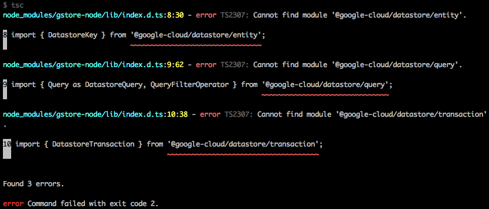

# gstore-node TypeScript definitions issue

## Reproduction steps

1. clone this repo
2. run `yarn` or `npm i` to install dependencies
3. run the build script: `yarn build` or `npm run-script build`
4. observe errors in tsc output:



```
node_modules/gstore-node/lib/index.d.ts:8:30 - error TS2307: Cannot find module '@google-cloud/datastore/entity'.

8 import { DatastoreKey } from '@google-cloud/datastore/entity';
                               ~~~~~~~~~~~~~~~~~~~~~~~~~~~~~~~~

node_modules/gstore-node/lib/index.d.ts:9:62 - error TS2307: Cannot find module '@google-cloud/datastore/query'.

9 import { Query as DatastoreQuery, QueryFilterOperator } from '@google-cloud/datastore/query';
                                                               ~~~~~~~~~~~~~~~~~~~~~~~~~~~~~~~

node_modules/gstore-node/lib/index.d.ts:10:38 - error TS2307: Cannot find module '@google-cloud/datastore/transaction'.

10 import { DatastoreTransaction } from '@google-cloud/datastore/transaction';
                                        ~~~~~~~~~~~~~~~~~~~~~~~~~~~~~~~~~~~~~


Found 3 errors.
```
